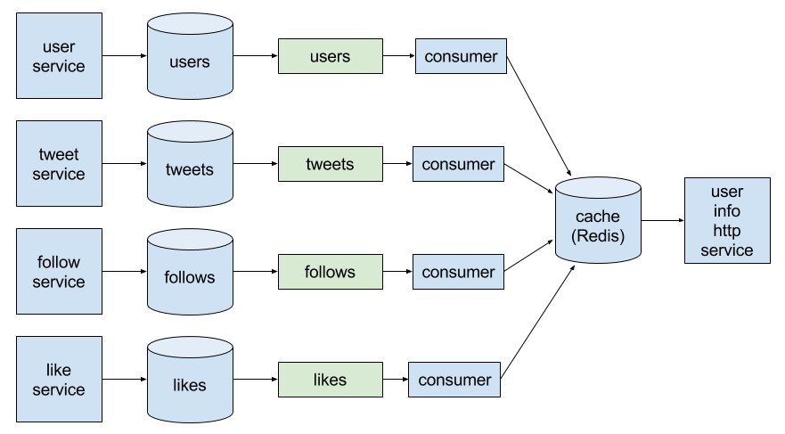
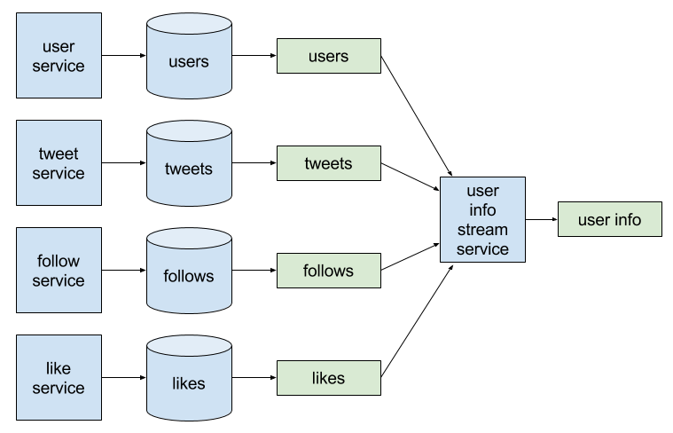

- [x] main ideas draft
- [x] polish up rough ideas into proper English
- [x] moar diagrams
- [x] intro
- [ ] confluent review
- [ ] code only impls kafka streams => rocksdb in service, not kafka connect, redis, interactive queries, etc

# [Blog Post Title]

As web developers, we often need to build services that query data from multiple sources in complex ways. To improve performance, these services often pre-compute materialized views and store them in caches. In this article, we'll explore a few problems with this typical approach to populating these caches, and see the wide variety of new solutions to these problems that are made possible simply by sending data changes to Kafka topics.

## Building a New Service

Imagine that we are asked to build a new service that provides a single point of read access to data from multiple sources within our company. Data is created and updated by those other sources, not this new service. We may need to query multiple tables or databases (or other services), performing complex (and potentially expensive) joins and aggregations. Other services within our company will obtain this derived data from our new service, using it in various ways.

To provide business value, this new service needs to be low latency, providing very fast response times under non-trivial load (e.g. 95th percentile HTTP response time under 5 msec, and max 10 msec, at 1000 HTTP requests/sec). This service may be part of a UI, where [fast responses are important for a good experience](https://www.nngroup.com/articles/response-times-3-important-limits/). Transactional consistency with the other systems of record is *not* required; we can tolerate data update delays, but they should be bounded (e.g. 95th percentile updates available in this service within 5 sec, and max 10 sec). Breaking these SLAs should result in humans being alerted.

To provide a concrete (but imaginary!) example, let's say we work at Twitter, and this new service provides read access to *user information* comprised of various user profile fields that users can edit, along with summary counts of various things related to the user. This User Information Service can then be used by other services, e.g. front-end desktop and mobile services can quickly get user information to display, the HTTP API can get user information to return as JSON, etc.


The User Information Service will provide a single HTTP resource: `GET /users/:userId`, which will either return a `404` response if `userId` does not exist, or a `200` response with user information in a JSON object.

```json
{
  "userId": "12542832",
  "username": "zcox",
  "name": "Zach Cox",
  "description": "Engineering @Uptake",
  "location": "Chicago, IL",
  "webPageUrl": "https://theza.ch/",
  "joinedDate": "Tue Jan 22 15:14:44 +0000 2008",
  "profileImageUrl": "https://pbs.twimg.com/profile_images/692897038124515331/NCpgt2Iz.jpg",
  "backgroundImageUrl": "https://pbs.twimg.com/profile_banners/12542832/1350571359/1500x500",
  "tweetCount": 3826,
  "followingCount": 1096,
  "followerCount": 887,
  "likeCount": 203
}
```

Let's assume that the data this service needs is stored in a relational database (e.g. Postgres) in normalized tables. (Twitter's actual data storage is probably not like this, but many existing systems that we're all familiar with do follow this standard model, so let's roll with it.) With this architecture we would likely end up with the following tables:


A classic implementation of this service would likely end up querying the DB directly using SQL.

```
SELECT * FROM users WHERE user_id = ?

SELECT COUNT(*) FROM tweets WHERE user_id = ?

SELECT COUNT(*) FROM follows WHERE follower_id = ?

SELECT COUNT(*) FROM follows WHERE followee_id = ?

SELECT COUNT(*) FROM likes WHERE user_id = ?
```

So the new service just goes directly to the source tables to get the data it needs to fulfill its requests.


Many existing services that generate lots of revenue are implemented like this, and if this approach meets all requirements, then great!

However, many developers have discovered problems with this approach over the years. First off, it's somewhat complex to assemble all of the data needed to fulfill the requests: we are performing multiple queries across multiple tables. This is a fairly simple example; if our service had different requirements, these aggregations could be much more complex, with grouping and filtering clauses, as well as joins across multiple tables.

Second, it's expensive: these queries are aggregating a (potentially) large number of rows. While I may not have a large number of followers, [Katy Perry has over 90 million](https://twitter.com/katyperry/followers). This puts load on the database, increases response latency of our service, and these aggregations are repeated on every request for the same `userId`.

From an architectural perspective, our new service would be sharing data stores with other services. In the world of microservices, this is [generally considered an anit-pattern](http://shop.oreilly.com/product/0636920033158.do). The shared data store tightly couples the services together, preventing them from evolving independently.

## Introducing a Cache

The standard solution to the above problems is to add a cache, such as Redis. Our service can compute the results of complex queries and store them in the cache, creating a materialized view, which is then easily queried using a simple, fast key lookup. This materialized view cache belongs only to our new service, decoupling it a bit from other services.


However, introducing this cache into our service presents some new problems. While our service can now do a single fast key lookup to get the materialized view from the cache instead of querying the DB, it still has to query the DB and populate the cache on a cache miss, so the complex DB queries remain. When a key is found in the cache, how do we know if the materialized view is up-to-date or stale? We can use a TTL on cache entries to bound staleness, but the lower the TTL, the less effective the cache is.

These problems would be solved if we could just update the materialized views in the cache whenever any data changed in those source tables. Our new service would have no complex DB queries, only simple, fast cache lookups. There would never be cache misses, and the materialized views in the cache would never be stale. How can we accomplish this?


If we have a mechanism to send inserted and updated rows in those tables to Kafka topics, then we can consume those data changes and update the cached materialized views. This will split updating the materialized views and querying the cache into separate, decoupled services.

## Sending Data Changes to Kafka Topics

We will send all data changes from each source table into its own Kafka topic. Because [tables and logs are dual](https://engineering.linkedin.com/distributed-systems/log-what-every-software-engineer-should-know-about-real-time-datas-unifying), this essentially replicates each table into a Kafka topic. Consumers of these topics can then replicate the original tables or transform them however they wish.


Each row in the original table becomes a message sent to the topic. The message key is the row's primary key, and the message value contains the values of all columns in the row. The message key and value must be serialized to byte arrays; personally, I recommend using [Avro](http://avro.apache.org) along with the [Confluent Schema Registry](http://docs.confluent.io/3.1.1/schema-registry/docs/index.html), but the choice is yours. Any time a new row is inserted into the table, or an existing row is updated, that row is converted to a message and sent to the Kafka topic. If a row is deleted, we can also send a message with a `null` value to remove that row from the topic. We also enable [log compaction](http://kafka.apache.org/documentation#compaction) on this topic so that only the most recent version of each row is retained, so the topic size only grows in the number of rows, not the number of changes to those rows. We refer to such topics as *changelog* topics, since they contain a log of changes made to the table.

As an example, if we insert two rows into a table, we end up with two messages on the changelog topic. The message key is shown on top of the message value.


If a row is updated, a new message is sent to the changelog topic, and Kafka log compaction eventually deletes the old message for that row.


[Kafka Connect](http://kafka.apache.org/documentation#connect) with the [Confluent JDBC connector](http://docs.confluent.io/3.1.1/connect/connect-jdbc/docs/index.html) provides a simple way to send table changes to a Kafka topic. It periodically queries the database for new and updated rows in the table, converts each row to a message, and sends it to the changelog topic.

If you're using Postgres, [Bottled Water](https://github.com/confluentinc/bottledwater-pg) is also worth looking at. It is a Postgres extension that uses logical decoding to send new, updated and deleted rows to changelog topics. These changes get to Kafka faster than using Kafka Connect, but it may not be quite production-ready today for all use cases, and of course is restricted only to Postgres. Similar change data capture tools may be available for other databases.

The application that modifies data in the database can also send data change messages to the changelog topic itself. This approach is known as *dual-writes*. It is generally not recommended, however, since it adds complexity to the application, you need to handle situations such as not sending the change message on a failed transaction, and change messages could end up out-of-order on the topic. If possible, it's best to use one of the change data capture approaches described above.

## Updating Materialized Views in the Cache

Our new User Information service receives `GET /users/:userId` requests and returns a user information JSON object for the `userId`. The ideal materialized view for the service is just a simple key lookup by `userId` that returns all of the fields we need to put into JSON. We could use Redis for this materialized view cache, or we could even use a single new table in the RDBMS, with one column per JSON field. There are, of course, many options for storing materialized views, and we can choose the right data store for our use case.

To update the materialized view cache, we register a [Kafka consumer](http://kafka.apache.org/documentation#theconsumer) on each changelog topic. The consumer receives each data change message from Kafka, and then updates the cache in some way. In our example, we have four source database tables, so we will have four Kafka changelog topics: users, tweets, follows, and likes. We will also have four Kafka consumers.



In the consumer descriptions below, we'll provide examples of storing the materialized views in Postgres and Redis. For Postgres, we use a table named `user_information` with one column per field of the materialized view. For Redis, we store each materialized view in a hash with key `user-information:$userId`.

The users topic consumer puts user fields from the message into the materialized view for the `userId` key:
- Postgres (upsert): `INSERT INTO user_information (user_id, username, name, description, ...) VALUES (?, ?, ?, ?, ...) ON CONFLICT DO UPDATE`
- Redis: `HMSET user-information:$userId username $username name $name description $description ...`

The tweets topic consumer increments the tweet count field for the tweet's `userId`:
- Postgres: `UPDATE user_information SET tweet_count = tweet_count + 1 WHERE user_id = ?`
- Redis: `HINCRBY user-information:$userId tweet-count 1`

The follows topic consumer increments both the follower count for the follow's `followeeId`, and the following count for the follow's `followerId`:
- Postgres: 
  - `UPDATE user_information SET follower_count = follower_count + 1 WHERE user_id = ?`
  - `UPDATE user_information SET following_count = following_count + 1 WHERE user_id = ?`
- Redis:
  - `HINCRBY user-information:$followeeId follower-count 1`
  - `HINCRBY user-information:$followerId following-count 1`

The likes topic consumer increments the like count for the like's `userId`:
- Postgres: `UPDATE user_information SET like_count = like_count + 1 WHERE user_id = ?`
- Redis: `HINCRBY user-information:$userId like-count 1`

With this approach, we have essentially used an external data store (Postgres or Redis) to join the changelog topics together and store the result of stateful computations (the most recent user fields and counts of tweets/follows/likes by `userId`). For many use cases, this may be a great solution. However, there are a few potential issues that we may run in to. The changelog topics may be so high volume (i.e. lots of data changes) that too many writes are sent to the cache. Batching the cache writes, or scaling the cache up/out may be possible, or may not be. The request load on our new http service may be so high that too many reads are sent to the cache. Maybe we can scale the cache up/out to handle the read load, maybe not. Perhaps we don't want to operate/maintain yet another data store. Or, the response time requirements for our service may be so low (e.g. single-digit msec or less) that we may not be able tolerate network I/O between our service and the cache. We may also want changes to materialized views in the cache to be consumable by other services, so we may want a changelog topic for the materialized views.

## Kafka Streams

A changelog topic receives a message each time a row in its corresponding table changes. As long as this table is part of a system in continuing operation within our business, the rows in it will change, and its changelog topic is therefore an unbounded data set. [Stream processing systems provide an effective way to process unbounded data sets](https://www.oreilly.com/ideas/the-world-beyond-batch-streaming-101). Let's examine how we can use [Kafka Streams](http://docs.confluent.io/3.1.1/streams/index.html) to process these unbounded streams of data changes in our changelog topics, and explore the benefits of doing so.

Instead of using four separate consumers each updating materialized views in some cache, we will instead create a single Kafka Streams program that consumes all 4 topics, and processes them into materialized views stored in local state. There are then several options for making the materialized views in this state accessible to the User Information service.



### Computing Materialized Views

Kafka Streams provides a Java API, but we will show examples below in Scala. First we create a `KStreamBuilder`, which is the main entry point into the Kafka Streams DSL.

```scala
val builder = new KStreamBuilder
```

We need to compute the count of tweets created by each user. To do this, we consume the tweets topic, repartition it by selecting the tweet's `userId` as a new message key, and then count tweets by this key.

```scala
val tweetCounts: KTable[String, Long] = 
  builder
    .stream[String, Tweet](tweetsTopic)
    .selectKey((tweetId: String, tweet: Tweet) => tweet.getUserId)
    .groupByKey()
    .count("tweetCounts")
```

This produces a table with a count for each `userId`. Below, we will join this table with the stream of user updates.

Similarly, for each user we need to compute both the number of other users they are following and the number of other users following them. These counts can be computed by repartitioning the follows topic in different ways and counting by key.

```scala
val follows = builder.stream[String, Follow](followsTopic)

val followingCounts: KTable[String, Long] = 
  follows
    .selectKey((followId: String, follow: Follow) => follow.getFollowerId)
    .groupByKey()
    .count("followingCounts")

val followerCounts: KTable[String, Long] = 
  follows
    .selectKey((followId: String, follow: Follow) => follow.getFolloweeId)
    .groupByKey()
    .count("followerCounts")
```

Finally, we consume the users changelog topic, map each `User` into the materialized view type `UserInformation`, join in the various count tables from above, and output results to the user information topic.

```scala
builder
  .table[String, User](usersTopic, "users")
  .mapValues((user: User) => UserInformation.newBuilder
    .setUserId(user.getUserId)
    .setUsername(user.getUsername)
    .setName(user.getName)
    .setDescription(user.getDescription)
    .build)
  .leftJoin(tweetCounts, { (userInformation: UserInformation, tweetCount: Long) => 
    userInformation.setTweetCount(tweetCount)
    userInformation })
  .leftJoin(followingCounts, { (userInformation: UserInformation, followingCount: Long) => 
    userInformation.setFollowingCount(followingCount)
    userInformation })
  .leftJoin(followerCounts, { (userInformation: UserInformation, followerCount: Long) => 
    userInformation.setFollowerCount(followerCount)
    userInformation })
  .to(userInformationTopic)
```

Whenever this program receives a new message from one of the source topics, it updates the user information for some `userId` and that updated user information is output to the user information topic. This is essentially another changelog topic that other downstream services can consume and process however they wish. Let's examine a few different ways we can use this computed user information.

### Remote Cache

We could write a Kafka consumer that consumes the user information topic and writes to the same cache we used previously (Postgres or Redis). The User Information service would then query that cache to fulfill HTTP reqeusts.


### Local Cache

One alternative is for each instance of the User Information service to consume the user information topic and store it locally in its own RocksDB instance. User information is then obtained from RocksDB to serve the HTTP requests. RocksDB is local and very fast, requiring no network I/O or external services. 


We can scale this approach to match request load by running more (or fewer user) User Infmration service instances. Handling input changelog topic volume and service request volume is then decoupled. If total user information size exceeds a single machine's capacity, then we can partition the data between service instances, and front the services with a router that can route HTTP requests to the correct service instance.

When a new service instance starts up for the first time, it must populate its local RocksDB cache by consuming the changelog topic from the very beginning, causing a delay before the service is ready to respond to requests. Depending on how much data is in this topic, this delay may be negligible or it may be a very long time. When the service stops, due to a crash or an intentional restart, the RocksDB files are retained on disk and the topic can be consumed from the last committed offsets, resulting in very little startup delay. Kafka provides at-least-once messaging, but key-value updates are idempotent.

### Interactive Queries

Another interesting alternative is to use Kafka Streams' new [Interactive Queries](http://docs.confluent.io/3.1.1/streams/developer-guide.html#interactive-queries) functionality. This allows state in a Kafka Streams application to be queried directly, without outputting it to some external store (e.g. Postres, Redis, RocksDB). The Kafka Streams application itself can then become the service responding to HTTP requests. Interactive Queries is very new and does couple changelog topic processing with HTTP request serving, although this approach could reduce the number of moving parts in the system and could provide great performance. It is definitely worth assessing for use in your own systems.


## Summary

In this article we've worked through building a new service that must get data from multiple sources using complex queries, and the reasons why developers often choose cached materialized views. We also reviewed common problems with the typical approach to populating caches on-demand. Kafka enables a range of interesting solutions to these problems, by routing data changes to consumers which then pre-populate cached materialized views, leading to simpler, faster queries in services. This approach can be used with traditional caches (e.g. Redis) as well as local in-process caches (e.g. RocksDB) for extreme low-latency, or materialized views can even be obtained directly from Kafka Streams internal state stores via the new Interactive Queries feature. By simply sending data changes to Kafka changelog topics, many new solutions to long-standing problems become possible.
